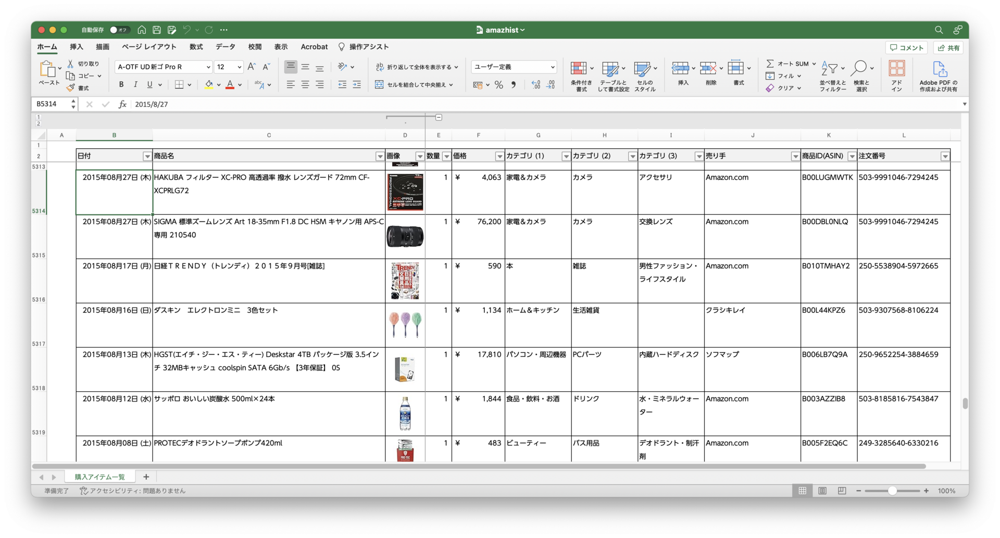

# 📊 amazhist-python

Amazon.co.jp の購入履歴を収集し、サムネイル付きの Excel ファイルとして出力するツール

[](https://github.com/kimata/amazhist-python/actions/workflows/test.yaml)
[](https://kimata.github.io/amazhist-python/pytest.html)
[](https://coveralls.io/github/kimata/amazhist-python?branch=main)

## 📋 概要

Amazon.co.jp の購入履歴を自動的に収集し、見やすい Excel 形式で出力します。

### 主な特徴

- 🛒 **購入履歴の収集** - Amazon.co.jp の注文履歴を自動取得
- 🖼️ **サムネイル付き出力** - 商品画像付きの Excel ファイルを生成
- 📦 **詳細情報の取得** - 商品名、価格、数量、カテゴリ、販売者、ASIN を収集
- 🔄 **途中再開対応** - 中断しても途中から再開可能
- 🔁 **エラーリトライ** - 失敗した項目のみを再取得可能
- 📝 **エラーログ管理** - エラー状況の確認・管理機能

### 出力サンプル



### データ収集の様子


## 🖥️ 動作環境

Python と Selenium が動作する環境で動作します。

- Linux (Ubuntu 22.04)
- Windows 11

## 🚀 セットアップ

### 1. 設定ファイルの準備

```bash
cp config.example.yaml config.yaml
```

`config.yaml` を編集して、Amazon.co.jp のログイン情報を設定：

```yaml
login:
  amazon:
    user: Amazon.co.jp のユーザ名
    pass: Amazon.co.jp のパスワード
```

## 💻 実行方法

### Docker を使用する場合（推奨）

```bash
# Docker のインストール（未インストールの場合）
sudo apt install docker.io docker-compose-v2

# 実行
docker compose run --rm amazhist
```

### Docker を使用しない場合

#### uv を使用（推奨）

```bash
# uv のインストール（未インストールの場合）
curl -LsSf https://astral.sh/uv/install.sh | sh

# 依存関係のインストールと実行
uv sync
uv run python src/app.py
```

### Windows で実行する場合

[リリースページ](https://github.com/kimata/amazhist-python/releases) から `amazhist-windows_x64-binary-*.zip` をダウンロードし、中に入っている `amazhist.exe` を実行してください。

> ⚠️ **注意**: 環境によってはウィルス判定されることがあります。これは Python スクリプトを [Nuitka](https://nuitka.net/) で実行ファイルに変換していることが原因です。検疫されてしまった場合は、Windows Defender の設定を一時的に変更してください。

### コマンドラインオプション

```bash
# 設定ファイルを指定
uv run python src/app.py -c custom-config.yaml

# データ収集せず Excel 出力のみ
uv run python src/app.py -e

# 強制的に全データを再収集
uv run python src/app.py -f

# 指定した年の注文のみ再取得
uv run python src/app.py -y 2024

# エラーが発生した項目のみ再取得
uv run python src/app.py -r

# サムネイル画像なしで出力
uv run python src/app.py -N

# エラーログを表示
uv run python src/app.py -E

# 解決済みエラーも含めて表示
uv run python src/app.py -E -a

# デバッグモード（1件のみ収集、キャッシュ無視）
uv run python src/app.py -D
```

### エラー管理と再取得について

データ収集中にエラーが発生した場合、エラー情報がデータベースに記録されます。

#### エラーログの確認 (`-E`)

```bash
# 未解決のエラーを表示
uv run python src/app.py -E

# 解決済みエラーも含めて全件表示
uv run python src/app.py -E -a
```

エラーログには以下の情報が含まれます：

- **種別**: エラーの種類（timeout, parse_error, no_detail_link など）
- **コンテキスト**: エラーが発生した処理（order, category, thumbnail, year）
- **注文番号/商品名**: 該当する注文や商品の情報
- **URL**: エラーが発生したページ

#### エラー項目の再取得 (`-r`)

```bash
uv run python src/app.py -r
```

以下の項目を再取得します：

1. **年単位の再巡回**: 注文件数の取得に問題があった年を再巡回
2. **注文の再取得**: パースに失敗した注文を再取得
3. **カテゴリの再取得**: カテゴリ情報の取得に失敗した商品を再取得
4. **サムネイルの再取得**: サムネイル画像の取得に失敗した商品を再取得

再取得に成功した項目は自動的に「解決済み」としてマークされます。

## ⏱️ 実行時間について

注文履歴の数が多い場合、1時間以上かかることがあります。放置しておくことをお勧めします。

中断した場合でも、再度実行することで途中から再開できます。また、新しい注文が増えた場合も、前回以降のデータのみを収集します。

## ❓ FAQ

### 画像認証を求められる

稀に画像認証（CAPTCHA）を求められることがあります。その場合、以下のようなメッセージが表示されます：

```
「output/captcha.png」に書かれているテキストを入力してください:
```

画像ファイルを確認し、表示されている文字列を入力してください（最後に Enter が必要です）。

## 🔧 トラブルシューティング

### 「巡回ロボットの準備をします...」で止まる

内部的に使用している Chrome のプロファイルデータが破損している可能性があります。`data/chrome` ディレクトリを削除すると改善します。

```bash
rm -rf data/chrome
```

## 📚 参考

Amazon 公式では購入履歴の CSV を提供するサービスがあります。購入日・商品・価格等の基本情報だけで十分な場合はこちらが便利です。

**利用方法**: Amazon.co.jp の「アカウントサービス」→「[データをリクエストする](https://www.amazon.co.jp/hz/privacy-central/data-requests/preview.html)」

## 📝 ライセンス

Apache License Version 2.0

---

<div align="center">

**⭐ このプロジェクトが役に立った場合は、Star をお願いします！**

[🐛 Issue 報告](https://github.com/kimata/amazhist-python/issues)

</div>
