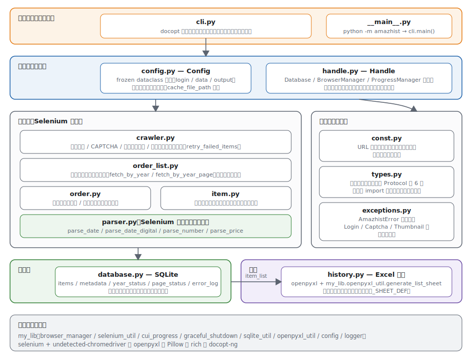
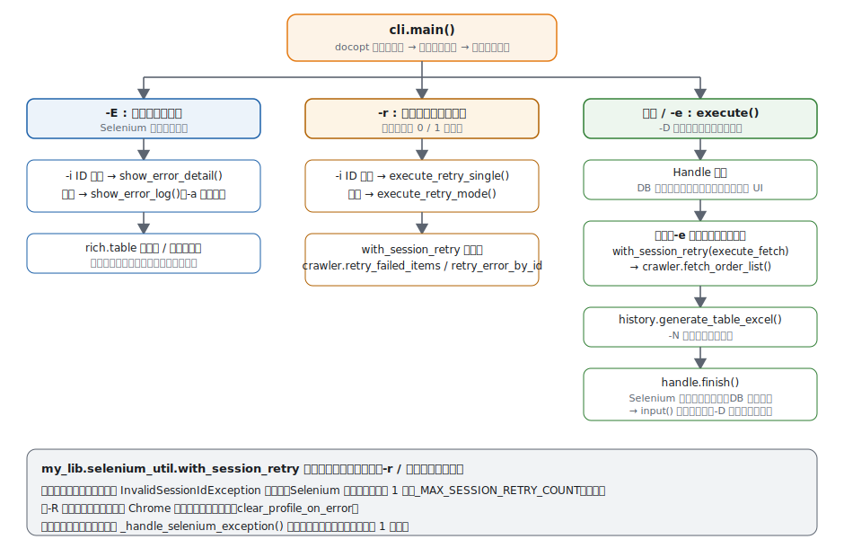
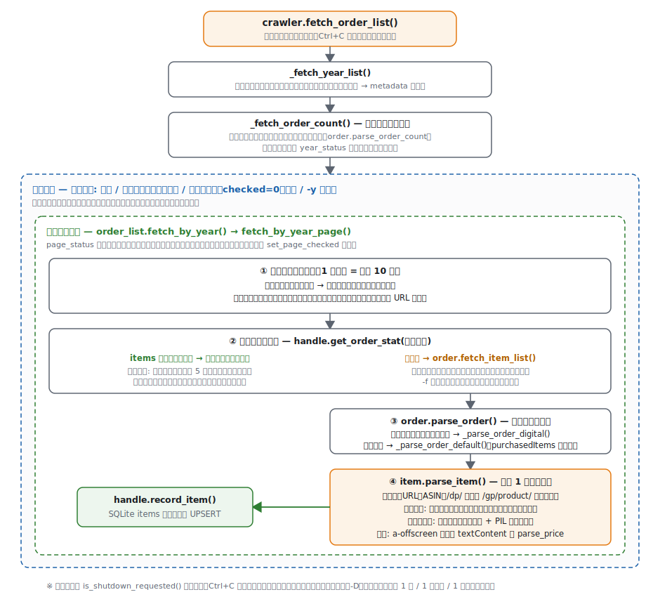
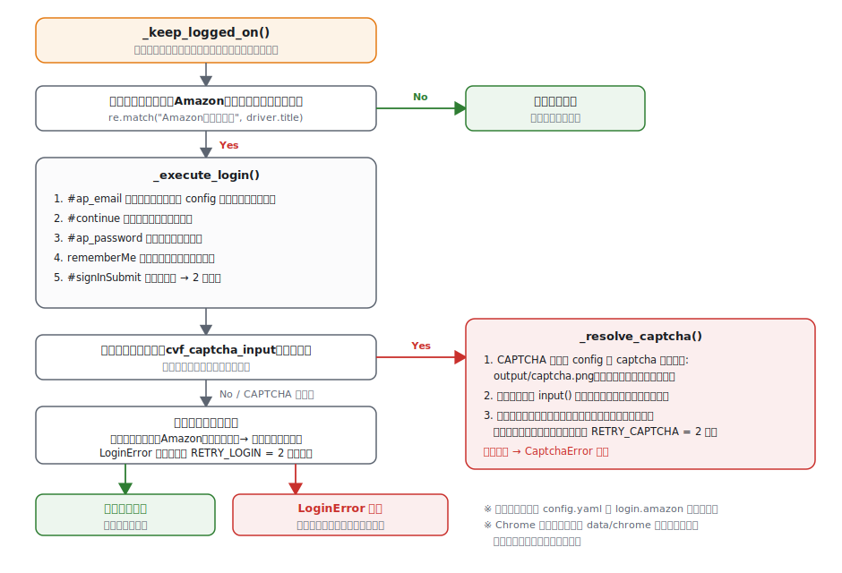
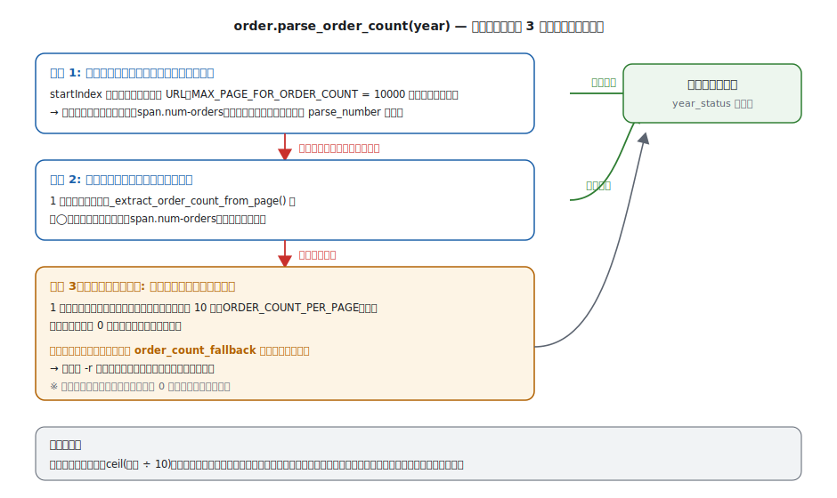
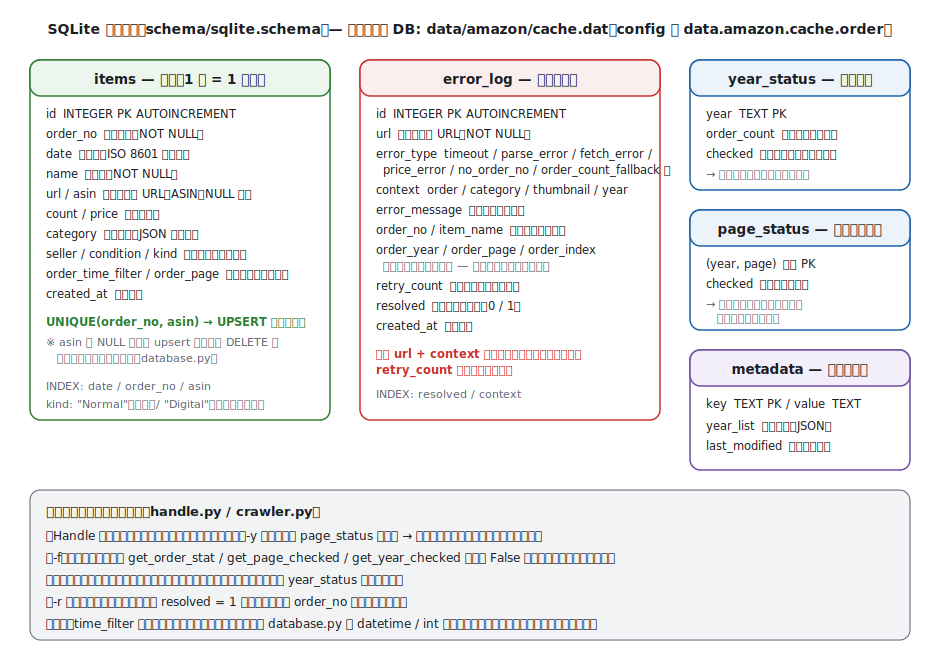
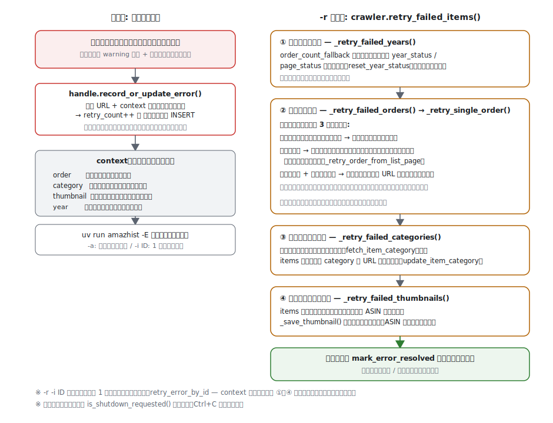

# アーキテクチャ

amazhist-python の内部構造をまとめたドキュメントです。記述はすべて `src/amazhist/` 以下の実装に基づいています。

## 全体像

Amazon.co.jp の注文履歴ページを Selenium で巡回し、商品情報を SQLite にキャッシュしながら収集、最後に openpyxl でサムネイル付き Excel を生成する、という一方向のパイプラインです。中断・再開・エラーリトライを SQLite 上の状態管理で実現しているのが特徴です。



### モジュール一覧

| モジュール | 責務 |
| --- | --- |
| `cli.py` | docopt による引数解析、モード分岐、セッション復旧付きの実行ハーネス、エラーログ表示 |
| `__main__.py` | `python -m amazhist` のエントリーポイント（`cli.main()` を呼ぶだけ） |
| `config.py` | 設定の frozen dataclass 階層（`Config` / `LoginConfig` / `DataConfig` / `OutputConfig` など）とパス解決プロパティ |
| `handle.py` | `Handle`: Database・BrowserManager・ProgressManager を束ねるアプリケーション状態。全処理に引き回される |
| `crawler.py` | ログイン・CAPTCHA 解決・年単位の巡回制御・エラーリトライの実行 |
| `order_list.py` | 注文一覧ページの巡回（`fetch_by_year` / `fetch_by_year_page`）、キャッシュスキップ、早期終了判定 |
| `order.py` | 注文詳細ページのパース（通常 / デジタル注文）、年間注文件数の取得 |
| `item.py` | `Item` dataclass、商品 1 件のパース、カテゴリ取得、サムネイル保存 |
| `parser.py` | Selenium 非依存の純粋なテキスト解析関数（日付・数値・価格） |
| `database.py` | SQLite アクセス層。商品・進捗・メタデータ・エラーログの CRUD |
| `history.py` | Excel 生成（列定義 `_SHEET_DEF` と `my_lib.openpyxl_util.generate_list_sheet`） |
| `const.py` | URL テンプレート、リトライ回数、エラータイプなどの定数 |
| `types.py` | コールバック関数の `Protocol` 型定義（6 種） |
| `exceptions.py` | カスタム例外階層 |

## 実行フローと CLI モード

`cli.main()` はオプションに応じて 3 系統に分岐します。



- **`-E`（エラーログ表示）**: Selenium を起動せず、DB の `error_log` を rich のテーブルで表示します。`-i ID` で 1 件の詳細表示。
- **`-r`（エラー再取得）**: `retry_failed_items()` を実行します。`-i ID` 指定時は該当エラー 1 件のみ（`retry_error_by_id()`）。
- **通常実行 / `-e`**: 収集（`-e` 時はスキップ）→ Excel 生成 → 終了処理。`-D`（デバッグ）はキャッシュ無視を強制し、1 件収集で打ち切ります。

収集系の処理は `my_lib.selenium_util.with_session_retry` でラップされ、ブラウザクラッシュ（`InvalidSessionIdException`）時に最大 1 回だけ Selenium を再起動して再実行します。`-R` 指定時はその際に Chrome プロファイルを削除します。

## 収集パイプライン

収集の本体は `crawler.fetch_order_list()` で、「年リスト取得 → 年ごとの注文件数取得 → 年ループ → ページループ → 注文ループ → 商品パース」という入れ子構造になっています。



### ログインと CAPTCHA

ページ遷移のたびに `_keep_logged_on()` が呼ばれ、サインイン画面へ飛ばされていたら自動でログインし直します。画像認証（CAPTCHA）が出た場合は画像をファイルに保存し、ターミナルでユーザーに入力を求めます。



リトライ回数は `const.py` で管理されています: `RETRY_LOGIN = 2`、`RETRY_CAPTCHA = 2`、`RETRY_URL_ACCESS = 3`（タイムアウト時のページ再読込）、`RETRY_FETCH = 2`、`RETRY_THUMBNAIL = 3`、`RETRY_CATEGORY = 2`。

### 注文件数の取得

プログレスバーの総量と総ページ数の計算に使う年間注文件数は、Amazon 側の表示ゆらぎに備えて 3 段階のフォールバックで取得します。最終手段（注文カードの実カウント）を使った場合は `order_count_fallback` エラーとして記録し、`-r` での年単位再巡回の対象にします。



### キャッシュと再開

「中断しても途中から再開できる」仕組みは、粒度の異なる 3 つの状態で実現されています。

| 粒度 | 保存先 | 判定 |
| --- | --- | --- |
| 注文単位 | `items` テーブル | `get_order_stat()`: 注文番号が既にあれば詳細ページを開かない |
| ページ単位 | `page_status` テーブル | 処理完了ページはスキップし、プログレスだけ進める |
| 年単位 | `year_status` テーブル | `checked = 1` の年は巡回自体をスキップ |

キャッシュを無効化する契機は次のとおりです。

- `Handle` 生成時に「今年」「キャッシュ最終更新年」「`-y` 指定年」の `page_status` を削除する（新しい注文を取りこぼさないため）
- `-f` 指定時は `get_order_stat` / `get_page_checked` / `get_year_checked` が常に `False` を返す
- `-r` の年単位再巡回では `reset_year_status()` が年・ページ両方の状態を削除する

また今年の巡回には**早期終了**があります。「今年が処理済み・商品が 1 件以上ある・未解決エラーがない」場合に限り、キャッシュ済みの注文が 5 件連続（`_CONSECUTIVE_CACHE_HITS_THRESHOLD`）したらその年の残りページを打ち切り、全ページを処理済み扱いにします。

## データベース

SQLite ファイル（既定では `data/amazon/cache.dat`）に 5 テーブルを持ちます。スキーマは `schema/sqlite.schema` にあり、起動時に `CREATE TABLE IF NOT EXISTS` で適用されます。



`database.py` は行データをそのまま返さず、`Item` / `ErrorLog` / `FailedOrderInfo` / `FailedCategoryItem` / `FailedThumbnailItem` といった frozen dataclass に変換して返します。日付や年フィルタは文字列として保存し、読み出し時に `datetime` / `int` へ変換します（旧スキーマにカラムがない場合のフォールバック付き）。

`items` の一意性は `UNIQUE(order_no, asin)` + `INSERT OR REPLACE` で担保しますが、SQLite は UNIQUE 制約で NULL 同士を別値として扱うため、ASIN が取れない商品については upsert 時の先行 DELETE と起動時の重複掃除（`_cleanup_duplicate_null_asin_items`）で重複を防いでいます。

## エラー管理とリトライ

収集中のエラーは処理を止めずに `error_log` へ記録し、後から `-r` でまとめて再取得する設計です。同一 URL + context の未解決エラーは二重登録せず `retry_count` を増やします。



注文の再取得（`_retry_single_order()`）は、エラーに記録された情報に応じて戦略を変えます。

1. 注文番号もページ内位置もない → 該当ページ全体を再巡回
2. 過去の年 → 注文一覧ページに戻り、ページ内位置または注文番号で注文を特定して詳細リンクを再取得
3. 現在の年 + 注文番号あり → 注文番号から詳細 URL を構築して直接取得（新規注文でページ内の位置がずれる可能性があるため一覧を辿らない）

## Excel 生成

`history.generate_table_excel()` が `items` テーブルの全件を日付順に読み出し、`my_lib.openpyxl_util.generate_list_sheet` でシート「【アマゾン】購入」を生成します。

- 列は `_SHEET_DEF` で宣言的に定義: ショップ / 日付 / 商品名 / 画像 / 数量 / 価格 / カテゴリ（3 列）/ 売り手 / 商品ID(ASIN) / 注文番号
- ASIN 列は商品ページへ、注文番号列は注文詳細ページへのハイパーリンク付き
- サムネイルはサムネイルディレクトリ（既定: `data/amazon/thumb`）の `<ASIN>.png` から埋め込み（`-N` で省略可。行の高さもサムネイル有無で切替）
- フォントは config の `output.excel.font` を openpyxl の Normal スタイルに適用
- 進捗は 6 ステップ（`PROGRESS_STEPS_EXCEL`）のプログレスバーで表示

`Item` dataclass は `__getitem__` / `__contains__` を実装しており、`my_lib.openpyxl_util` から辞書風にアクセスできるようになっています。

## 横断的な設計

### コールバック注入と Protocol

`order_list.py` は `crawler.py` の関数（`visit_url`、`_keep_logged_on`、URL 生成、シャットダウン判定など）を直接 import せず、引数として受け取ります。循環 import を避けるためで、これらのコールバックの型は `types.py` に `Protocol` として定義されています（`VisitUrlFunc` / `KeepLoggedOnFunc` / `GetCallerNameFunc` / `GenHistUrlFunc` / `GenOrderUrlFunc` / `IsShutdownRequestedFunc`）。

### 例外階層

`exceptions.py` に定義されたカスタム例外を使用します。

```
AmazhistError
├── LoginError            ログイン失敗
├── CaptchaError          画像認証の解決失敗
└── ThumbnailError        サムネイル異常の基底（path 属性を持つ）
    ├── ThumbnailEmptyError    画像データが空
    ├── ThumbnailSizeError     保存後のファイルサイズが 0
    └── ThumbnailCorruptError  PIL の verify() で破損検出
```

### グレースフルシャットダウン

`my_lib.graceful_shutdown` によるシグナルハンドラで Ctrl+C を受け取り、フラグを立てるだけで即座には止めません。年・ページ・注文・商品の各ループが `is_shutdown_requested()` を確認して安全な位置で抜けるため、DB の状態が壊れず、次回実行時にそのまま再開できます。

### 進捗表示

`Handle` が保持する `my_lib.cui_progress.ProgressManager`（Amazon オレンジ `#e47911` のテーマ）に、ステータスバー（`set_status`）と複数のプログレスバー（`set_progress_bar` / `get_progress_bar`）を集約しています。CAPTCHA などで `input()` を使う際は `pause_live()` / `resume_live()` で表示を一時停止します。

## 外部依存

| ライブラリ | 用途 |
| --- | --- |
| `my_lib`（作者の共通ライブラリ、git 経由） | `browser_manager`（Chrome プロファイル管理）/ `selenium_util`（リトライ・タブ操作・ページダンプ・セッション復旧）/ `cui_progress`（進捗 UI）/ `graceful_shutdown` / `sqlite_util`（スキーマ適用）/ `openpyxl_util`（シート生成）/ `config`（スキーマ検証付き設定読込）/ `logger` |
| `selenium` + `undetected-chromedriver` | ブラウザ自動化 |
| `openpyxl` | Excel 生成 |
| `Pillow` | サムネイル画像の破損検証 |
| `rich` | エラーログ表示のテーブル・進捗表示 |
| `docopt-ng` | CLI 引数解析 |

## テスト構成

`tests/unit/` に Selenium 実機に依存しないユニットテストがあります（Selenium は `unittest.mock` でモック）。`parser.py` のような純関数はそのまま、`crawler.py` / `order_list.py` などは WebDriver・WebElement をモックしてパースロジックを検証しています。実行は `uv run pytest`（並列・E2E 除外）。
